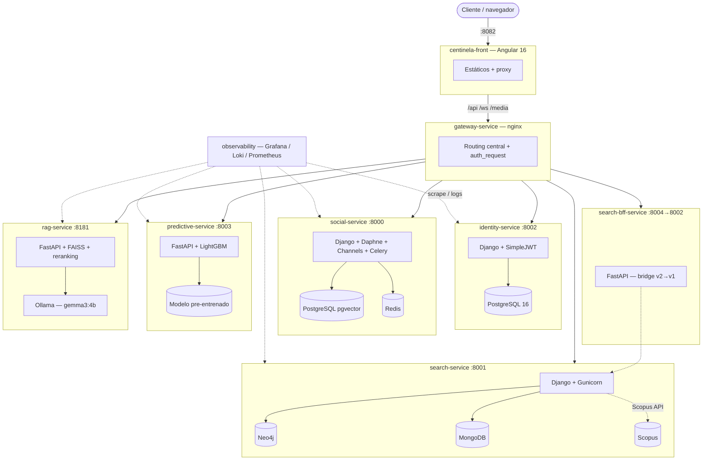

# Centinela

Plataforma científica multi-servicio para investigadores: búsqueda de literatura académica (integrada con Scopus), análisis de redes de coautoría, consenso social sobre publicaciones, predicción de producción científica y búsqueda semántica asistida por LLM (RAG).

El sistema está dividido en **13 repositorios independientes**, cada uno con su propio ciclo de vida, historial y pipeline de CI/CD, orquestados como microservicios sobre una red Docker compartida (`centinela-net`).

Este documento es el punto de entrada para quien se une al equipo: qué hace cada repo, cómo se comunican, qué patrón de arquitectura siguen y cómo se despliega todo.

## Arquitectura



Todos los backends comparten la red Docker externa `centinela-net` y se resuelven entre sí por alias de servicio (nunca `localhost`). El frontend nunca habla directo con un backend — todo pasa por `gateway-service`, que centraliza el ruteo `/api/<servicio>/` y la validación de auth (`auth_request` contra `identity-service`).

## Repositorios

| Repo | Rol | Stack |
|---|---|---|
| [`centinela-front`](https://github.com/PlataformaIntegradaInvestigadores/centinela-front) | SPA — UI de toda la plataforma | Angular 16 + Material + Tailwind |
| [`gateway-service`](https://github.com/PlataformaIntegradaInvestigadores/gateway-service) | Gateway central de routing y auth | nginx |
| [`identity-service`](https://github.com/PlataformaIntegradaInvestigadores/identity-service) | Autenticación e identidad de usuarios | Django 5 + SimpleJWT + PostgreSQL |
| [`social-service`](https://github.com/PlataformaIntegradaInvestigadores/social-service) | Feed social, consenso, jobs, comentarios (WebSocket) | Django 5 + Channels + Celery + pgvector + Redis |
| [`search-service`](https://github.com/PlataformaIntegradaInvestigadores/search-service) | Motor de búsqueda: grafo de autores/artículos/afiliaciones, integración Scopus, dashboards | Django 5 + Neo4j + MongoDB |
| [`search-bff-service`](https://github.com/PlataformaIntegradaInvestigadores/search-bff-service) | Fachada v2 estable sobre la API v1 de `search-service` | FastAPI |
| [`predictive-service`](https://github.com/PlataformaIntegradaInvestigadores/predictive-service) | Predicción de producción científica por afiliación | FastAPI + LightGBM |
| [`rag-service`](https://github.com/PlataformaIntegradaInvestigadores/rag-service) | Búsqueda semántica asistida por LLM sobre el corpus de Scopus | FastAPI + FAISS + Ollama (Gemma 3) |
| [`observability`](https://github.com/PlataformaIntegradaInvestigadores/observability) | Stack de logs/métricas/alertas de toda la plataforma | Grafana + Loki + Prometheus + Alloy + Falco |
| [`centinela-ops`](https://github.com/PlataformaIntegradaInvestigadores/centinela-ops) | Scripts y roles de despliegue productivo (repo privado) | bash |
| [`tech-governance`](https://github.com/PlataformaIntegradaInvestigadores/tech-governance) | Convenciones de contribución y commits del org | docs |
| [`technical-documentation`](https://github.com/PlataformaIntegradaInvestigadores/technical-documentation) | Anexos técnicos puntuales (instalación, BD, despliegue) | docs |
| [`demo-repository`](https://github.com/PlataformaIntegradaInvestigadores/demo-repository) | Repo demo autogenerado por GitHub, sin uso | — |

## Patrón de arquitectura

Los 6 backends (Django y FastAPI) siguen el mismo esquema de capas — **Clean/Hexagonal Architecture** — para que moverse entre repos sea predecible:

```
<módulo>/
  domain/            # entidades y contratos de repositorio, sin dependencias externas
    entities/
    repositories/
  application/        # casos de uso y lógica de orquestación
    use_cases/
    services/
  infrastructure/      # el mundo exterior: HTTP, DB, migraciones
    api/v1/
      views/            # (o endpoints/ en FastAPI)
      serializers/       # (o schemas/ en FastAPI)
      urls/
    migrations/
  tests/               # test_*.py (pytest / pytest-django)
```

Los repos Django (`social-service`, `search-service`, `identity-service`) y los FastAPI (`search-bff-service`, `predictive-service`, `rag-service`) mapean este mismo patrón a su forma idiomática. `predictive-service` es una variante más liviana (sin `use_cases/` explícito, servicio de un solo propósito).

## CI/CD

Cada repo de servicio corre su propio pipeline en **GitHub Actions**, con un runner self-hosted (`ticcd`) para los pasos de deploy:

1. **Tests unitarios** (+ de integración donde aplica) con bases de datos reales en contenedores efímeros del job.
2. **Gate de cobertura**: mínimo **90%** (`--cov-fail-under=90` en Python, `karma.conf.js` `check.global` en Angular). El build falla si no se cumple.
3. **Build de imagen Docker**.
4. **Deploy automático a staging** al mergear a `develop`: `git fetch/reset --hard` + `docker compose up -d --build --no-deps <servicio>` + healthcheck con rollback automático si falla.

`main` se mantiene protegido y solo recibe cambios validados en `develop`.

## Convenciones

- **Branches**: `feature/*` → `develop` · `hotfix/*` → `main` · `chore/*` para tareas de mantenimiento.
- **Commits**: [Conventional Commits](https://www.conventionalcommits.org/) (`feat:`, `fix:`, `chore:`, `test:`, `refactor:`, `docs:`), en inglés, con el *por qué* en el cuerpo.
- **PRs**: mínimo 2 aprobaciones, todas las conversaciones resueltas. Plantilla centralizada en [`.github/pull_request_template.md`](../pull_request_template.md).
- **Código**: inglés para variables, funciones, comentarios, rutas. Sin comentarios decorativos — solo lo no obvio.
- Cada repo trae su propio `README.md` con instrucciones detalladas para levantarlo, sus variables de entorno y cómo correr sus tests.

## Cómo empezar

1. Clonar los repos que necesites junto a este org (mismo directorio padre).
2. Crear la red compartida: `docker network create centinela-net`.
3. Seguir el `README.md` de cada repo — todos siguen la misma estructura (stack, cómo levantar, tests, CI/CD).
4. Para el panorama completo de infraestructura y cómo agregar un microservicio nuevo, ver `centinela-ops/ARCHITECTURE.md`.
